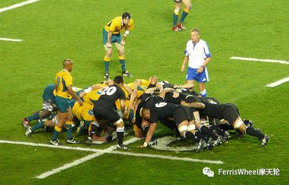
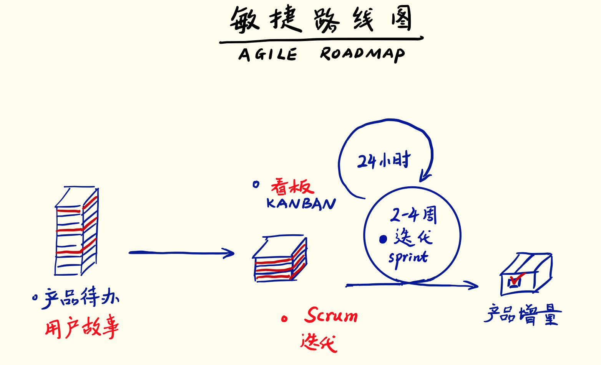
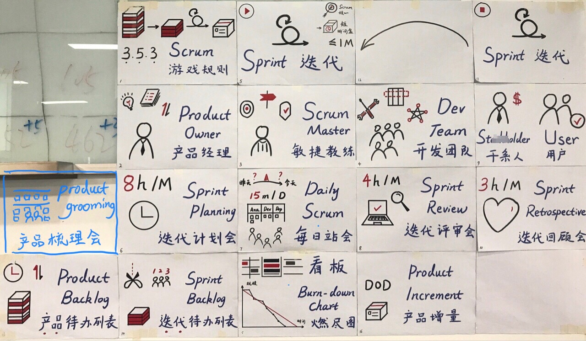

Scrum，是一个开发、交付和持续支持复杂产品的框架。
  
# 一、为什么用Scrum
 
1、解决复杂、自适应难题；
2、同时高效并创造性地交付可能最高价值的产品。
 
# 二、谁参与Scrum？
 
1、产品负责人；
2、开发团队；
3、敏捷教练。
 
# 三、怎么做好Scrum？
 
1、执行迭代；
2、迭代计划会；
3、每日站会；
4、迭代评审会；
5、迭代回顾会
 
注：迭代是Scrum的核心事件，也是一个容器，包含迭代计划会、每日站会、迭代评审会、迭代回顾会。
 
# 四、Scrum做些什么？

1、迭代
- 迭代开始前准备好产品待办列表； 
 
2、迭代计划会
- 迭代计划会产出迭代待办列表；
 
 
3、每日站会
- 应用看板；
- 绘制燃尽图和其他度量指标；
 
 
4、迭代评审会
- 迭代评审会产出可以发布的产品增量；
 
 
5、迭代回顾会
- 迭代回顾会反思"如何让下个迭代做得更好"，产生改进故事，放入产品待办清单。
 
 
五、Scrum的历史
 
 
1986 Scrum这个词汇首次应用于产品开发。
 
1986年，竹内弘高和 野中郁次郎在New New Product Development Game文章首次提到将Scrum应用与产品开发，他们指出：传统的"接力式"的开发模式已经不能满足快速灵活的市场需求，而整体或"橄榄球式"的方法----团队作为一个整体前进，在团队的内部传球并保持前进，这也许可以更好的满足当前激烈的市场竞争。
 
1993年Jeff Sutherland首次将Scrum用于软件开发。敏捷思想深受日本工业界最佳实践的影响，尤其是丰田和本田公司推行的精益原则，以及竹内弘高和 野中郁次郎开发的知识管理策略。受到以上思想的影响，以及对世界范围内软件项目的研究，Jeff Sutherland在 1993年首次在Easel公司定义了用于了软件开发行业的Scrum流程，并开始实施。
 
1995年Jeff Sutherland和Ken Schwaber规范化了Scrum框架，并在OOPSLA 95上公开发布。
 
2001年 敏捷宣言及原则发布、敏捷联盟成立，Scrum是其中一种敏捷方法。
 
2001年，Ken Schwaber和Mike Beedle推出第一本Scrum书籍《Scrum敏捷软件开发》。
 
2002年Ken Schwaber 和Mike Cohn共同创办了Scrum联盟。

参考：

