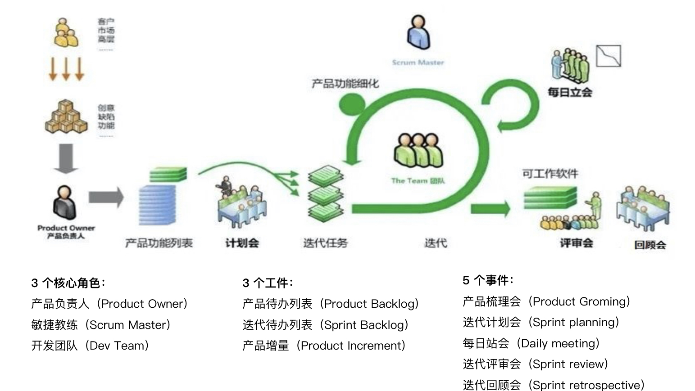
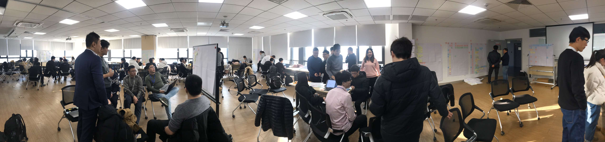

身处数字化时代，个体和组织都面临着数字化转型的挑战：如何提升价值？如何快速交付？如何借助数字化浪潮，扬帆出海？敏捷思想在个体和组织的发展和进化过程中，正产生着越来越深远的影响。

本文和各位探讨的话题是敏捷和引导，主要包括以下内容：

- 敏捷和引导
- 敏捷教练和引导师
- 敏捷方法和引导技术
- 敏捷与引导的差异

# 敏捷和引导

敏捷（Agile）是一套用于开发、交付和持续支持复杂产品的思想、方法、实践和工具的集合。敏捷来源于软件开发，目前已经扩展到业务领域，例如营销、人力等。（相关：[什么是敏捷？](/md/什么是敏捷？.md)）

引导（Facilitation）是一种激发参与者群体间对话，轻松实现高质量产出的过程。[1]

圈内公认最能体现敏捷思想的是《敏捷软件开发宣言》中倡导的价值观和十二项原则。

图-敏捷宣言

图-敏捷原则

宣言网址：[http://agilemanifesto.org/](http://agilemanifesto.org/)，（相关：[敏捷宣言](/md/敏捷宣言.md)）

应对具有不确定性的外部环境，敏捷宣言倡导个体和互动、成果导向、相互合作以及拥抱变化等四个价值观和十二原则。敏捷和引导对于激发团队和组织活力的理解和做法总体是一致的。

# 敏捷教练和引导师

敏捷教练（团队外部的教练叫Agile Coach，团队内部的教练叫Scrum Master）是一位服务性领导和伙伴，借助敏捷原则和方法，支持团队和组织提升绩效。（相关：[敏捷教练](/md/敏捷教练.md)）

    

引导师(Facilitator)是创建合作式客户关系，规划团队流程、创建和维持参与的场域、建立并保持专业知识、展现正面的专业态度、带领团队得到有用成果的人。[1]

作为敏捷教练，主要的任务包括：

- 培训：为团队导入敏捷方法；
- 引导：为团队示范敏捷仪式会议，群策群力取得成果；
- 教练：支持团队，去除团队内在障碍，激发团队潜能。

引导作为敏捷教练的核心能力之一，是敏捷教练顺畅开展各项敏捷活动的基础能力。

# 敏捷方法、实践和引导技术

基于敏捷思想，敏捷实践者探索出了大量的敏捷方法和实践，其中比较有代表性的是Scrum方法。（相关：[什么是Scrum？](/md/什么是Scrum？.md)）

敏捷方法的一个显著特点是明确了一个迭代的最小沟通会议，包括产品梳理会、迭代计划会、每日站会、迭代评审会和迭代回顾会。

这些会议形成了PDCA的快速反馈闭环，也形成了敏捷团队的协作仪式和文化。

敏捷教练在辅导团队时，为了确保这些会议的参与人投入、保证会议成果质量和团队共识，往往会采用引导技术。

特别是对于规模化敏捷，例如项目群计划会、项目群同步会、项目群评审和项目群回顾，更依赖于引导技术的支撑。

图-某个项目群的计划会现场

在项目群计划会，项目群教练会使用视觉引导和世界咖啡，帮助团队制定团队迭代计划，识别跨团队的任务依赖。在项目群系统演示，会借鉴开放空间的方法，保证感兴趣的团队成员参与评审产品增量。

# 敏捷与引导的差异

 敏捷教练和引导师在和团队一起的工作场景非常相似，也有一些差异：
 
 1. 敏捷教练的工作通常以咨询项目的形式启动，在项目前期会为团队或组织导入敏捷方法，与引导师的中立位置有差异。敏捷教练在项目前期带有引导式培训的性质。
 2. 敏捷教练在引导敏捷仪式时，有些会议成果往往有特定的要求，例如产品愿景、商业画布、用户画像、用户旅程、影响地图、故事地图、迭代计划等，在业内也有通用的样式。这与引导师在引导工作坊时，会议成果的灵活开放有差异。
 3. 内部敏捷教练作为敏捷团队的成员，参与团队的日常迭代工作，这也与引导师的中立位置有所差异。外部敏捷教练在工作坊之外，还需要为团队和组织设计敏捷方案，开展团队度量和持续改进的工作，带有咨询顾问的性质。

参考资料： 
1. 《基于引导技术的工作坊设计》，林士然