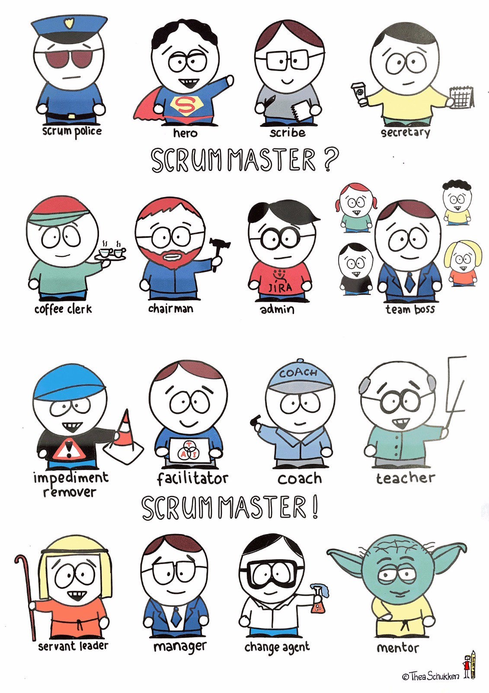

身处数字化时代，个体和组织都面临着数字化转型的挑战：如何提升价值？如何快速交付？如何借助数字化浪潮，扬帆出海？敏捷思想在个体和组织的发展和进化过程中，正产生着越来越深远的影响。

本文和各位探讨的话题是敏捷和引导，主要包括以下内容：

- 敏捷和引导
- 敏捷教练和引导师
- 敏捷方法和引导技术

# 敏捷和引导

敏捷（Agile）是一套用于开发、交付和持续支持复杂产品的思想、方法、实践和工具的集合。敏捷来源于软件开发，目前已经扩展到业务领域，例如营销、人力等。（相关：[什么是敏捷？](/md/什么是敏捷？.md)）

引导（Facilitation）是一种激发参与者群体间对话，轻松实现高质量产出的过程。[1]

圈内公认最能体现敏捷思想的是《敏捷软件开发宣言》中倡导的价值观和十二项原则。

[此处添加宣言和原则图片]

敏捷的方法和实践活动绝大部份基于引导理念和引导技术，两者对于激发团队和组织活力的理解和做法总体一致。

# 敏捷教练和引导师

敏捷教练（团队外部的教练叫Agile Coach，团队内部的教练叫Scrum Master）是一位服务性领导和伙伴，借助敏捷原则和方法，支持团队和组织提升绩效。（相关：[敏捷教练](/md/敏捷教练.md)）

    

引导师(Facilitator)是创建合作式客户关系，规划团队流程、创建和维持参与的场域、建立并保持专业知识、展现正面的专业态度、带领团队得到有用成果的人。[1]

作为敏捷教练，主要的任务包括：
- 培训：为团队导入敏捷方法；
- 引导：为团队示范敏捷仪式会议，群策群力取得成果；
- 教练：支持团队，去除团队内在障碍，激发团队潜能。

引导作为敏捷教练的核心能力之一，是敏捷教练顺畅开展各项敏捷活动的基础能力。

# 敏捷方法、实践和引导技术

基于敏捷思想，敏捷实践者探索出了大量的敏捷方法和实践，其中比较有代表性的是Scrum方法。（相关：什么是Scrum？）

[Scrum经典图片]

敏捷教练的工作场景和引导师有大量重合，

团队敏捷仪式会议推荐使用引导技术，例如迭代梳理会、每日站会、迭代评审会和迭代回顾会。

对于规模化敏捷，例如项目群计划会、项目群同步会、项目群评审和项目群回顾，更依赖于引导技术的支撑。

参考资料： 

1. 《基于引导技术的工作坊设计》，林士然