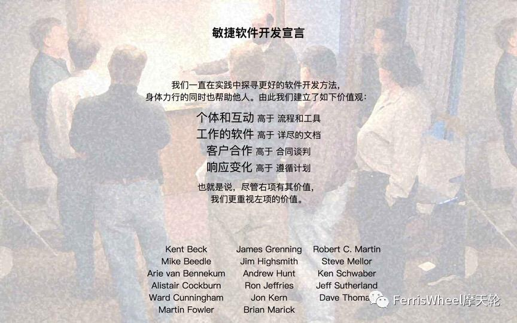
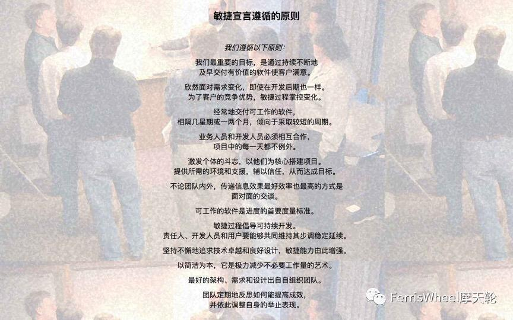

# 敏捷软件开发宣言

图- 敏捷宣言

我们一直在实践中探寻更好的软件开发方法，
身体力行的同时也帮助他人。由此我们建立了如下价值观：

- 个体和互动 高于 流程和工具
- 工作的软件 高于 详尽的文档
- 客户合作 高于 合同谈判
- 响应变化 高于 遵循计划

也就是说，尽管右项有其价值，
我们更重视左项的价值。

# 敏捷十二原则

图- 敏捷原则

我们遵循以下原则：
1. 我们最重要的目标，是通过持续不断地及早交付有价值的软件使客户满意。
2. 欣然面对需求变化，即使在开发后期也一样。为了客户的竞争优势，敏捷过程掌控变化。
3. 经常地交付可工作的软件，相隔几星期或一两个月，倾向于采取较短的周期。
4. 业务人员和开发人员必须相互合作，项目中的每一天都不例外。
5. 激发个体的斗志，以他们为核心搭建项目。提供所需的环境和支援，辅以信任，从而达成目标。
6. 不论团队内外，传递信息效果最好效率也最高的方式是面对面的交谈。
7. 可工作的软件是进度的首要度量标准。
8. 敏捷过程倡导可持续开发。责任人、开发人员和用户要能够共同维持其步调稳定延续。
9. 坚持不懈地追求技术卓越和良好设计，敏捷能力由此增强。
10. 以简洁为本，它是极力减少不必要工作量的艺术。
11. 最好的架构、需求和设计出自自组织团队。
12. 团队定期地反思如何能提高成效，并依此调整自身的举止表现。

参考：[http://agilemanifesto.org/](http://agilemanifesto.org/)

# History: The Agile Manifesto
On February 11-13, 2001, at The Lodge at Snowbird ski resort in the Wasatch mountains of Utah, seventeen people met to talk, ski, relax, and try to find common ground--and of course, to eat. What emerged was the Agile ‘Software Development’ Manifesto. 

Representatives from Extreme Programming, SCRUM, DSDM, Adaptive Software Development, Crystal, Feature-Driven Development, Pragmatic Programming, and others sympathetic to the need for an alternative to documentation driven, heavyweight software development processes convened.

Now, a bigger gathering of organizational anarchists would be hard to find, so what emerged from this meeting was symbolic--a Manifesto for Agile Software Development--signed by all participants. The only concern with the term agile came from Martin Fowler (a Brit for those who don’t know him) who allowed that most Americans didn’t know how to pronounce the word ‘agile’.

Alistair Cockburn’s initial concerns reflected the early thoughts of many participants. "I personally didn't expect that this particular group of agilites to ever agree on anything substantive." But his post-meeting feelings were also shared, "Speaking for myself, I am delighted by the final phrasing [of the Manifesto]. I was surprised that the others appeared equally delighted by the final phrasing. So we did agree on something substantive."
Naming ourselves "The Agile Alliance," this group of independent thinkers about software development, and sometimes competitors to each other, agreed on the Manifesto for Agile Software Development displayed on the title page of this web site.

But while the Manifesto provides some specific ideas, there is a deeper theme that drives many, but not all, to be sure, members of the alliance. At the close of the two-day meeting, Bob Martin joked that he was about to make a "mushy" statement. But while tinged with humor, few disagreed with Bob’s sentiments--that we all felt privileged to work with a group of people who held a set of compatible values, a set of values based on trust and respect for each other and promoting organizational models based on people, collaboration, and building the types of organizational communities in which we would want to work. At the core, I believe Agile Methodologists are really about "mushy" stuff--about delivering good products to customers by operating in an environment that does more than talk about "people as our most important asset" but actually "acts" as if people were the most important, and lose the word "asset". So in the final analysis, the meteoric rise of interest in--and sometimes tremendous criticism of--Agile Methodologies is about the mushy stuff of values and culture.

For example, I think that ultimately, Extreme Programming has mushroomed in use and interest, not because of pair-programming or refactoring, but because, taken as a whole, the practices define a developer community freed from the baggage of Dilbertesque corporations. Kent Beck tells the story of an early job in which he estimated a programming effort of six weeks for two people. After his manager reassigned the other programmer at the beginning of the project, he completed the project in twelve weeks--and felt terrible about himself! The boss--of course--harangued Kent about how slow he was throughout the second six weeks. Kent, somewhat despondent because he was such a "failure" as a programmer, finally realized that his original estimate of 6 weeks was extremely accurate--for 2 people--and that his "failure" was really the manager’s failure , indeed, the failure of the standard "fixed" process mindset that so frequently plagues our industry.

This type of situation goes on every day--marketing, or management, or external customers, internal customers, and, yes, even developers--don’t want to make hard trade-off decisions, so they impose irrational demands through the imposition of corporate power structures. This isn’t merely a software development problem, it runs throughout Dilbertesque organizations.

In order to succeed in the new economy, to move aggressively into the era of e-business, e-commerce, and the web, companies have to rid themselves of their Dilbert manifestations of make-work and arcane policies. This freedom from the inanities of corporate life attracts proponents of Agile Methodologies, and scares the begeebers (you can’t use the word ‘shit’ in a professional paper) out of traditionalists. Quite frankly, the Agile approaches scare corporate bureaucrats-- at least those that are happy pushing process for process’ sake versus trying to do the best for the "customer" and deliver something timely and tangible and "as promised"--because they run out of places to hide.

The Agile movement is not anti-methodology, in fact, many of us want to restore credibility to the word methodology. We want to restore a balance. We embrace modeling, but not in order to file some diagram in a dusty corporate repository. We embrace documentation, but not hundreds of pages of never-maintained and rarely-used tomes. We plan, but recognize the limits of planning in a turbulent environment. Those who would brand proponents of XP or SCRUM or any of the other Agile Methodologies as "hackers" are ignorant of both the methodologies and the original definition of the term hacker.

The meeting at Snowbird was incubated at an earlier get together of Extreme Programming proponents, and a few "outsiders," organized by Kent Beck at the Rogue River Lodge in Oregon in the spring of 2000. At the Rogue River meeting attendees voiced support for a variety of "Light" methodologies, but nothing formal occurred. During 2000 a number of articles were written that referenced the category of "Light" or "Lightweight" processes. A number these articles referred to "Light methodologies, such as Extreme Programming, Adaptive Software Development, Crystal, and SCRUM". In conversations, no one really liked the moniker "Light", but it seemed to stick for the time being.

In September 2000, Bob Martin from Object Mentor in Chicago, started the next meeting ball rolling with an email; "I'd like to convene a small (two day) conference in the January to February 2001 timeframe here in Chicago. The purpose of this conference is to get all the lightweight method leaders in one room. All of you are invited; and I'd be interested to know who else I should approach." Bob set up a Wiki site and the discussions raged.

Early on, Alistair Cockburn weighed in with an epistle that identified the general disgruntlement with the word ‘Light’: "I don't mind the methodology being called light in weight, but I'm not sure I want to be referred to as a lightweight attending a lightweight methodologists meeting. It somehow sounds like a bunch of skinny, feebleminded lightweight people trying to remember what day it is."

The fiercest debate was over location! There was serious concern about Chicago in wintertime--cold and nothing fun to do; Snowbird, Utah--cold, but fun things to do, at least for those who ski on their heads like Martin Fowler tried on day one; and Anguilla in the Caribbean--warm and fun, but time consuming to get to. In the end, Snowbird and skiing won out; however, a few people--like Ron Jeffries--want a warmer place next time.

We hope that our work together as the Agile Alliance helps others in our profession to think about software development, methodologies, and organizations, in new– more agile – ways. If so, we’ve accomplished our goals.

Jim Highsmith, for the Agile Alliance

©2001 Jim Highsmith