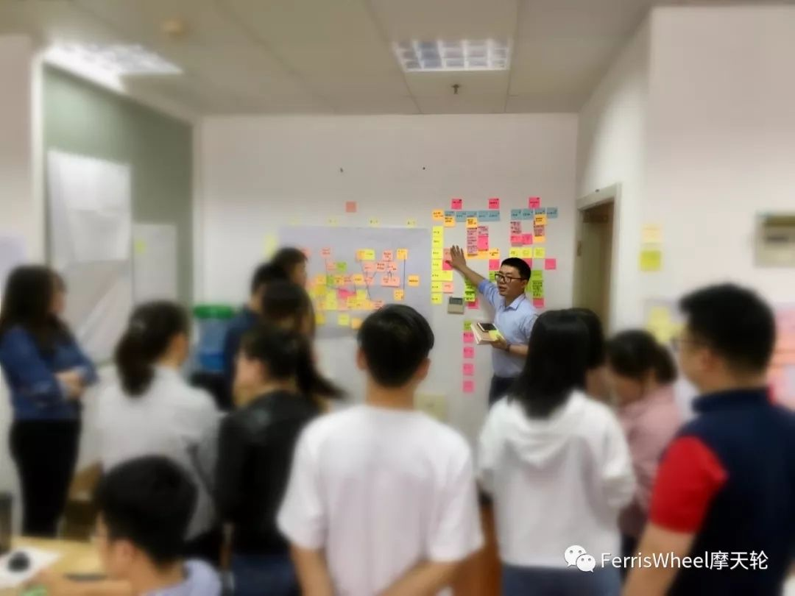

敏捷教练，是一位服务型领导[1]，借助敏捷方法，支持和陪伴团队提升绩效。
 
一、为什么要敏捷教练？
1、专注过程，剥离内容；
2、借事（敏捷）成人（团队），借假（敏捷方法）修真（团队心智）。
 
二、怎么做好敏捷教练？
1、培训，使团队学会使用敏捷方法；
2、引导，使团队顺利开展敏捷活动；
3、教练，为团队赋能；
 
三、敏捷教练做些什么？
1、培训
- 设计思维，以用户为中心，快速原型和迭代；
- 敏捷方法，开展团队冲刺，透明工作环境，顺畅交付有价值需求；
- 引导技术，群策群力，更容易的达成目标；
- 教练技术，去除内在限制，激发团队潜能。
 
2、引导
- 敏捷场域与视觉引导，准备敏捷工作环境和工具；
- 团队敏捷仪式，开好团队敏捷的固定会议；
- 专题工作坊，更高效促进专题解决；
 
3、教练
- 一对一教练，包括对项目发起人、产品经理、内部敏捷教练的教练；
 
四、提示
 
* 敏捷教练的隐喻

参考：
1. 服务型领导参考：Scrum Master: 如何成为服务型领导 (Servant Leader)? - 简书
