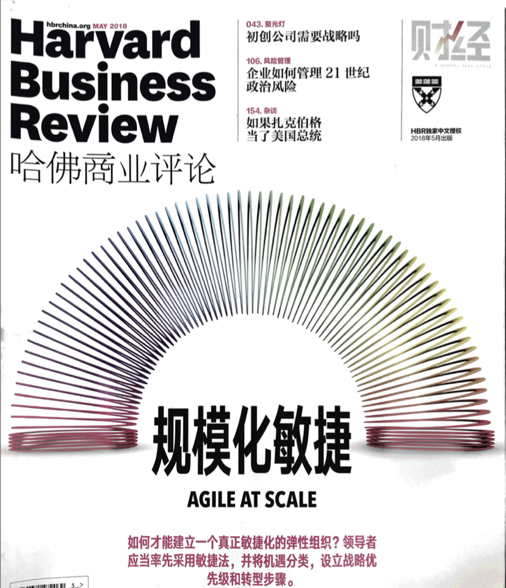
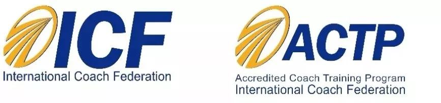

目录：
* 一、数字化转型中敏捷教练的重要作用
* 二、敏捷教练面临哪些挑战？
* 三、敏捷教练如何自我进化？
* 四、为什么参加法吉系统组织教练？
* 五、课程特色与信息

# 一、敏捷教练的作用

图片来源：《哈佛商业评论》中文版 2018.05期
身处VUCA时代，组织通过数字化转型，建立敏捷化的弹性组织，而敏捷教练在这个过程中发挥了至关重要的作用。
根据一项敏捷状态调查，有52%的受访者认为敏捷教练是组织敏捷转型的成功必备要素。

图片来源：《哈佛商业评论》中文版 2018.05期

# 二、敏捷教练面临哪些挑战？
敏捷教练这个职业极具吸引力，以下问题很直接：
* 我们花了多少时间研究敏捷实践本身，花了多少时间研究敏捷实践中的人和团队？
* 在各大敏捷微信群中，花了多大篇幅在争论敏捷框架的好坏，花多大篇幅在讨论如何让人更容易接受和采纳？
* 敏捷教练之间常交流的话题是敏捷方法和工具好学，但背后的人和团队的进化却不容易。
* 对于项目重要干系人：发起人、业务高管、技术高管，敏捷教练如何从容面对？
* 敏捷教练如何更好的支持敏捷团队的成长和进化？

图片来源：《哈佛商业评论》中文版 2018.05期

# 三、敏捷教练如何自我进化？
面对以上挑战，敏捷的方法和工具层面已经很难产生更大的效果，敏捷教练们纷纷将注意力焦点从"敏捷"转向"教练"。
 
教练，是客户的长期伙伴，通过创造性地引发客户深度思考的教练过程，激励客户最大化地提升自我认知与发觉职业潜能。---- 国际教练联合会（ICF）《教练道德准则》
 
专业的教练学习能够让敏捷教练内在更稳定，而外在又保持灵活，通过积极聆听和有力发问，为项目成员和团队创造觉察，从而产生富有创造力的行动。

【M1课程内容】

各环节设计：
- 场景与痛点收集
- Demo（拉帘子）
- 教练要点揭秘
- 学员实战练习

理论学习要点：

什么是教练？
* 传统对话与教练对话
* 教练起源
* 什么是教练？
* 教练原则与信念
* 教练状态
教练基本能力
* 建立信任
* 深度聆听
* 有力发问
* 直接沟通
教练模型
* 绩效模型
* 教练之箭
* 个体与组织心智模型
常用教练工具
* 核心价值观
* 假如工具
* 逻辑层次
* 平衡轮
* 位置感知
* 时间线
* 迪士尼策略
附录：
* ICF教练道德准则
* ICF专业教练8项核心能力
* 觉察日记
* 教练记录表
* 教练观察表
* 教练小时记录

# 四、为什么参加法吉系统组织教练
 
* 通过教练基础训练，以稳定的教练状态，运用各种教练方法从容应对敏捷转型的挑战；
* 通过高管教练，与项目发起人、高管等重要干系人深度对话，更容易获取支持；
* 通过团队教练，更有效的支持敏捷团队；
* 通过组织教练，从系统层面支持组织级的数字化转型。

# 五、课程特色与信息
* 一站式循序渐进的教练学习计划，涵盖M1教练基础课程、M2高管教练、团队教练和M3系统组织教练等各层次教练课程，极大节约选择、切换成本。
* 中文授课，节约了翻译和转换时间，有更多时间交流与练习；
* 课后30天练习，带组教练小组练习
* 结识一群志同道合的敏捷小伙伴。一个人可以走得很快。但一群人可以走的更远、更深；
* 本次课程已申请国际教练联合会（International Coach Federation，简称ICF，全球最大的专业教练组织）认证的最高级别的认证课程（ACTP, Accredited Coach Training Program）

【目标人群】
HRM、HRD、培训师、咨询顾问、敏捷教练、IT精英、产品经理、项目经理、OD、培训经理等各级企业管理者等。

M1组织教练基础课程价格：8800元
2020年1月9-12日    北京
2020年3月12-15日   北京
2020年4月16-19日   上海
2020年5月14-17日   深圳

[报名链接](https://mp.weixin.qq.com/s/GuIHpjU8lba1T1KpHzh-tQ)

M2、M3、M4，正在推出，敬请期待